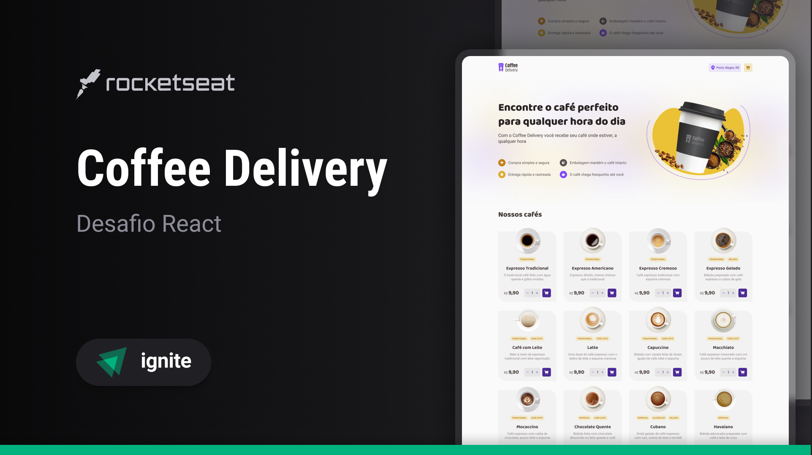

<h1 align="center">☕ Coffee Delivery</h1>

<p align="center">
  Aplicação e-commerce para compra de cafés com catálogo, carrinho,
  formulário de entrega e confirmação de pedido.
</p>

<p align="center">
  
</p>

<p align="center">
  <a href="#-tecnologias">Tecnologias</a>&nbsp;&nbsp;|&nbsp;&nbsp;
  <a href="#-recursos">Recursos</a>&nbsp;&nbsp;|&nbsp;&nbsp;
  <a href="#-rotas">Rotas</a>&nbsp;&nbsp;|&nbsp;&nbsp;
  <a href="#-estrutura">Estrutura</a>&nbsp;&nbsp;|&nbsp;&nbsp;
  <a href="#-como-executar">Como executar</a>
</p>

## ✨ Tecnologias

Esse projeto foi desenvolvido com as seguintes tecnologias:

- [Vite](https://vitejs.dev/)
- [React](https://react.dev/)
- [TypeScript](https://www.typescriptlang.org/)
- [Styled-Components](https://styled-components.com/)
- [React Router DOM](https://reactrouter.com/)
- [React Hook Form](https://react-hook-form.com/)
- [Zod](https://zod.dev/)
- [Phosphor Icons](https://phosphoricons.com/)

## 🔥 Recursos

- Catálogo de cafés com tags e descrição.
- Carrinho com controle de quantidade, remoção e total do pedido.
- Formulário de entrega com validação (React Hook Form + Zod).
- Persistência do carrinho em `localStorage`.
- Formatação de valores (`utils/formatMoney`).
- Navegação entre páginas (React Router DOM).
- Layout responsivo em páginas principais (Home, Checkout e Confirmação).

## 🧭 Rotas

- `/` Home: introdução e lista de cafés.
- `/completeOrder` Checkout: formulário de endereço e seleção de pagamento.
- `/orderConfirmed` Confirmação: resumo do pedido e dados de entrega.

## 🗂️ Estrutura

Principais pastas:

- `src/components`: componentes reutilizáveis (Header, Input, Button, etc.)
- `src/pages`: páginas da aplicação (Home, CompleteOrder, OrderConfirmed)
- `src/contexts`: contexto de carrinho (`CartContext`)
- `src/data`: dados estáticos de cafés
- `src/styles`: tema, estilos globais e layout
- `src/layouts`: `DefaultLayout` com a classe `container`

## 🚀 Como executar

Pré-requisitos:

- Node.js 18+ (Vite 5 requer Node >= 18)
- `npm` ou `pnpm`/`yarn`

Instalação e execução:

```bash
# Clonar o repositório
git clone <url-do-repositorio>
cd coffe-delivery

# Instalar dependências
npm install

# Ambiente de desenvolvimento
npm run dev
# Acesse: http://localhost:5173/

# Build para produção
npm run build

# Preview do build
npm run preview
# Acesse: http://localhost:4173/
```

## 🧪 Scripts úteis

- `npm run lint`: executa ESLint.
- `npm run build`: compila TypeScript e gera build Vite.
- `npm run dev`: inicia Vite em desenvolvimento.
- `npm run preview`: serve o build gerado.

## 📌 Observações

- O carrinho é persistido em `localStorage` pela chave `coffeeDelivery:cartItems`.
- A classe `.container` aplica largura máxima e padding horizontal para responsividade.

## 📄 Créditos

Desafio proposto na trilha Ignite. Projeto adaptado e evoluído com foco em boas práticas, acessibilidade e responsividade.